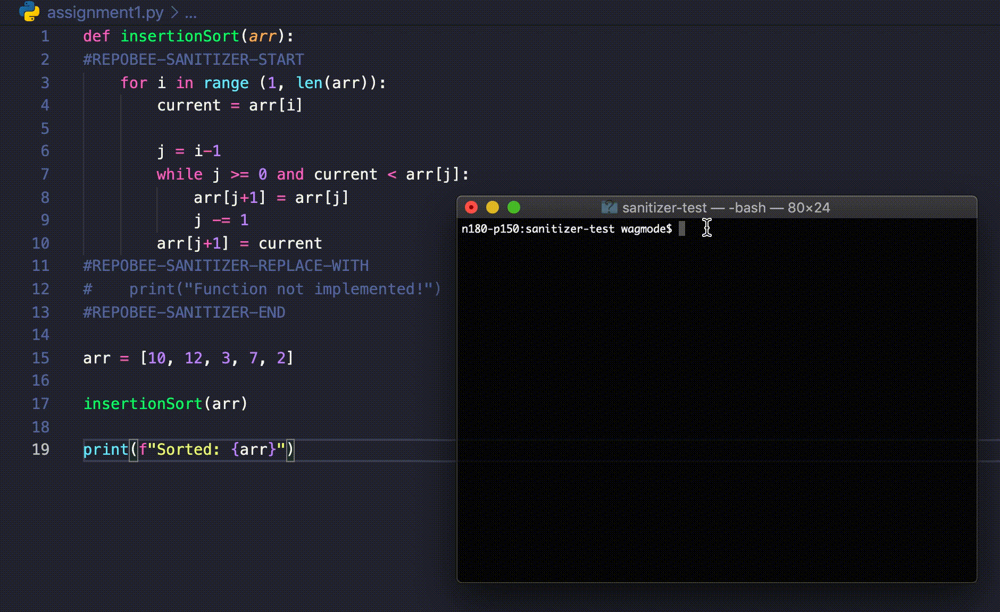

[](https://codecov.io/gh/repobee/repobee-sanitizer)


[](LICENSE)
[](https://github.com/ambv/black)


# Overview

## Problem

When working with version control systems to maintain code, it is possible to want different versions of a file or even a whole repository. An example of this would be a teacher using GitHub to manage separate template repositories (repo) for code assignments, solutions, and unit tests. 

Managing solutions and assignments separately becomes an issue when updates are made. If the assignment is updated, the solution and tests also have to be updated, and the teacher has to ensure that all repos are compatible, we call this drift. Working with separate repos simultaneously can be a pain as the teacher has to jump around and make changes in different places, essentially cluttering one's workplace.

## Solution

To combat the issues mentioned above, we have developed `Sanitizer`, a plug-in for RepoBee that 
allows the user to manage their assignments and solutions inside a single repository.

`Sanitizer` adds the commands `sanitize file` and `sanitize repo` that lets the user sanitize
files and git repositories. `Sanitizer` works by removing or replacing text by going through 
files as text, looking for a certain markup described below. The most simple usage 
consists of a start and end marker, where content between these two markers will be 
removed, or "sanitized" as it were.

This solution allows teachers to safely work inside a single repository, without the chance of solutions reaching students when creating student repositories (human error not accounted for). 
The problem of drift is also removed, and as a bonus, teachers can easily create their assignments
using solution driven development.

# Usage

## Install
Use `RepoBee`'s plugin manager to install and activate.

```
$ repobee plugin install
$ repobee plugin activate # persistent activation
```

`Sanitizer` only adds new commands, so we recommend [activating it persistently](https://repobee.readthedocs.io/en/latest/plugins.html#persistent-plugin-activation-and-deactivation) after installing. For general instructions on installing and using plugins, see [RepoBee's plugin docs](https://repobee.readthedocs.io/en/latest/plugins.html).

## Syntax

for `Sanitizer` to work, marker syntax must be correct, this includes
spelling of the markers themselves, the markers currently are as follows:

- REPOBEE-SANITIZER-START
    - REQUIRED: A block is not a block without a start marker
    - Indicates the start of a block. Any text will be removed until reaching
      a `REPLACE-WITH` or `END` marker.
- REPOBEE-SANITIZER-REPLACE-WITH
    - OPTIONAL: but requires a start and end block.
    - Any text between this marker and the next `END` marker will remain.
- REPOBEE-SANITIZER-END
    - REQUIRED: Must exist for each start block
    - Indicates the end of a block.
- REPOBEE-SANITIZER-SHRED
    - OPTIONAL: Can only exist on the first line of a file. If this exists,
      there cannot be any other markers of any type in the file
    - Having this marker will remove the entire file when running the
      `sanitize-repo` or `sanitize-file` commands

If a marker is incorrectly spelled, `repobee-sanitizer` will report an error.

## Prefixing:

`Sanitizer` blocks 

* Determines prefix as any text that comes before `REPOBEE-SANITIZER-START`
* Only determines prefix on a block-to-block basis, meaning that the prefix
  selected at a `START` marker must be used until and including the next `END`
  marker
  * This means that all `Sanitizer` blocks can have individual
    prefixes
* Code between replace and end markers **MUST** also be prefixed
* Prefixes inside `REPLACE-WITH` blocks are removed when sanitizing

## Example use cases

Consider the following code:

```java
class StackTest {
    @Test
    public void topIsLastPushedValue() {
REPOBEE-SANITIZER-START
        // Arrange
        int value = 1338;

        // Act
        emptyStack.push(value);
        stack.push(value);

        int emptyStackTop = emptyStack.top();
        int stackTop = stack.top();

        // Assert
        assertThat(emptyStackTop, equalTo(value));
        assertThat(stackTop, equalTo(value));
REPOBEE-SANITIZER-END
    }
}
```

>Example 1: The simplest usage of `Sanitizer` using a .java file

For this .java test file, the `santize-file` command will identify the START
and END markers, and proceed to remove the code between the markers. The result will look
like this:

```java
class StackTest {
    @Test
    public void topIsLastPushedValue() {
    }
}
```

`Sanitizer` also supports the `REPOBEE-SANITIZER-REPLACE-WITH` marker.
By adding a replace marker, we can specify code that should replace the removed
code. Example as follows:

```java
class StackTest {
    @Test
    public void topIsLastPushedValue() {
REPOBEE-SANITIZER-START
        // Arrange
        int value = 1338;

        // Act
        emptyStack.push(value);
        stack.push(value);

        int emptyStackTop = emptyStack.top();
        int stackTop = stack.top();

        // Assert
        assertThat(emptyStackTop, equalTo(value));
        assertThat(stackTop, equalTo(value));
REPOBEE-SANITIZER-REPLACE-WITH
        fail("Not implemented");
REPOBEE-SANITIZER-END
    }
}
```

> Example 2: The code is the same as for example 1, but we have added a
> `REPOBEE-SANITIZER-REPLACE-WITH` marker.

As we can see in Example 2, this lets us provide two versions of a function,
one that is current, and one that will replace it. Example 1 and 2 shows us a
piece of code used in the KTH course DD1338. This code is part of an assignment
where students are asked to implement a test function. The example shows a
finished solution that is available to the teachers of the course. However,
because of `Sanitizer` and the `REPLACE-WITH` marker, the code can be
reduced to the following:

```java
class StackTest {
    @Test
    public void topIsLastPushedValue() {
        fail("Not implemented");
    }
}
```

> Example 3: Sanitized code that is provided to students.

We can see that the only code that remains inside the function is that of the
`REPLACE-WITH` marker. This gives us the main usage that `repobee-santizer` was
developed for, it allows us to combine finished solutions with the
"skeletonized" solutions that are provided to students.

## Prefixing

Sometimes (usually) we want code that can run, its a good thing then that
`repobee-sanitizer` blocks can be commented out! Example 2 will produce the
same output as the following:

```java
class StackTest {
    @Test
    public void topIsLastPushedValue() {
//REPOBEE-SANITIZER-START
        // Arrange
        int value = 1338;

        // Act
        emptyStack.push(value);
        stack.push(value);

        int emptyStackTop = emptyStack.top();
        int stackTop = stack.top();

        // Assert
        assertThat(emptyStackTop, equalTo(value));
        assertThat(stackTop, equalTo(value));
//REPOBEE-SANITIZER-REPLACE-WITH
//        fail("Not implemented");
//REPOBEE-SANITIZER-END
    }
}
```

> Example 4: Java code with `repobee-sanitizer` related syntax commented out

`repobee-sanitizer` automatically detects if there is a prefix in front of any
markers. This way we can have java comments: `//`, python comments: `#` or
similar preceding our markers. **This means code can still compile!**

## Commands
`repobee-sanitizer` supports two main commands: `sanitize file` and `sanitize repo`

### The `sanitize file` command

`repobee sanitize file <infile> <outfile>` performs the sanitization operation described below directly on a file `infile` and writes the output to `outfile`. 

Running the following command will sanitize `input.txt` (given that it exists) and create the file `sanitized.txt` containing, you guessed it, the sanitized file. `sanitized.txt` will be overwritten if it already exists.

```
$ repobee sanitize file input.txt sanitized.txt
```

The `--strip` flag can also be used to reverse the operation, instead removing all sanitizer syntax from the file.

### The `sanitize repo` command

`sanitize repo` performs the sanitization protocol on an entire repository. It's most basic usage looks like so:
```
$ repobee sanitize repo --no-commit
```
Assuming that you're currently at the root of a Git repository, this will sanitize the current branch without making a commit.

#### Repo root
If you are not currently at the root of a repository, a path can be specified using the `--repo-root <path>` option.

#### Branches
Another important feature is working with branches, `repobee-sanitizer` was essentially made to manage differing branches. For an example, a repo can have a `solutions` and a `main` branch, where the `solutions` branch contains an entire solution to an assignment, as well as `sanitizer` `markers` (specified below). When we then sanitize the `solutions` branch, we create a slimmed-down version of our repo (that we would send to students), what we can then do is to specify which branch we want the sanitied version to end up on.

This is done using the `--target-branch <branch-name>` option. For example, if our repo is checked out to the branch `solutions` (that contains full solutions and `sanitizer` `markers`), Running:

``` 
$ repobee sanitize repo --target-branch main
```

will sanitize the currently checked out branch (in this case `solutions`) and commit the result to the specified branch, in this case `main`. Successfully using the `--target-branch` feature allows us to essentially retain two concurrent repositories while only having to update one of them should any changes or improvements be made to our course tasks.

#### Errors / Force
`repobee-sanitizer` does its best to ensure that nothing breaks while sanitizing. Therefore, when sanitizing a repo, `repobee-sanitizer` will always make sure you have no uncommited files in the repo as well as no syntax errors in your `sanitizer` syntax. If you do have an error, sanitizer will _not_ sanitize _anything_ until you fix any errors and run the command again. `repobee-sanitizer` even prevents you from committing if no changes will be made to the repo!

If you are completely and utterly sure that computers are stupid things and that you are a far superior being, you may use the `--force` flag to ignore any warnings related to uncommitted files/changes in the repo (Jokes aside this is necessary sometimes, like if you want to commit when no changes were made).

## License

See [LICENSE](LICENSE) for details.
